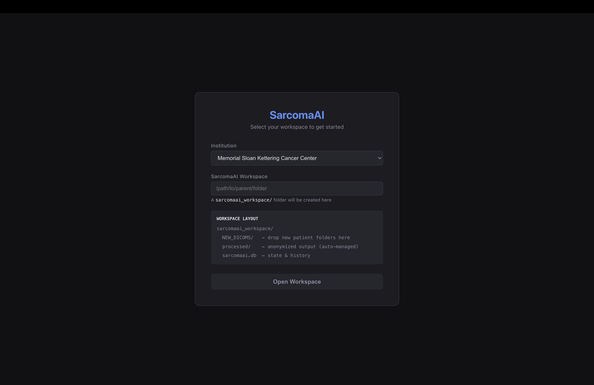
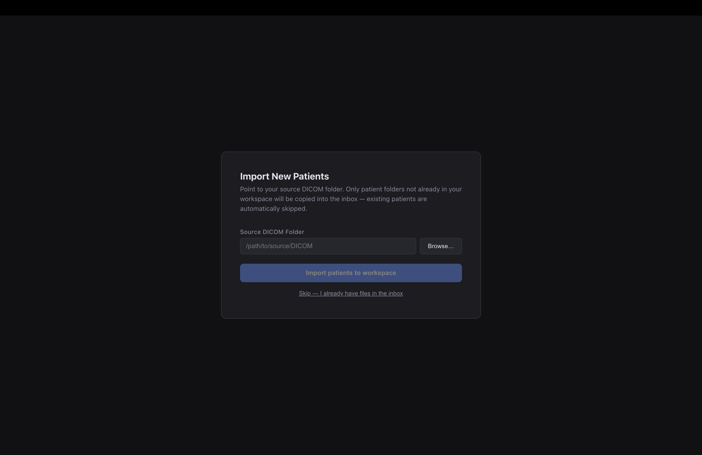
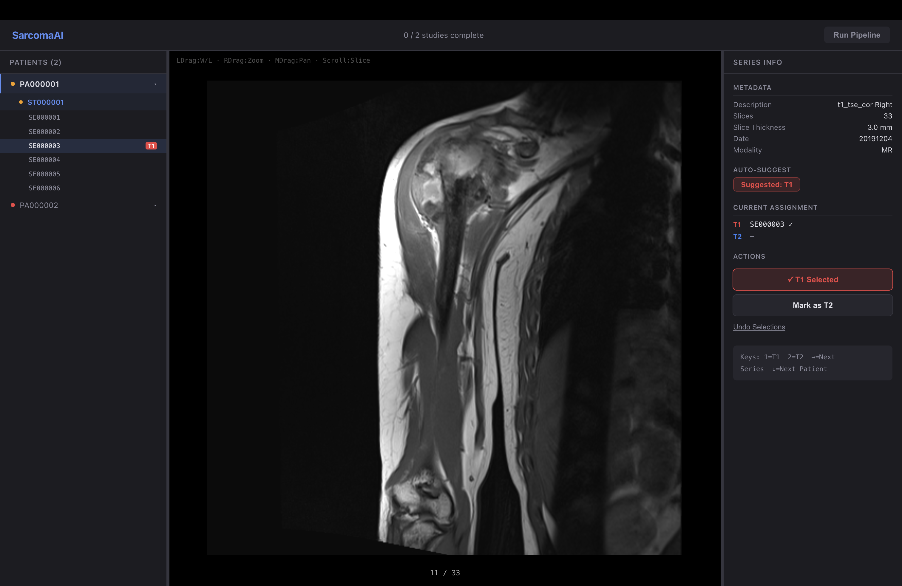
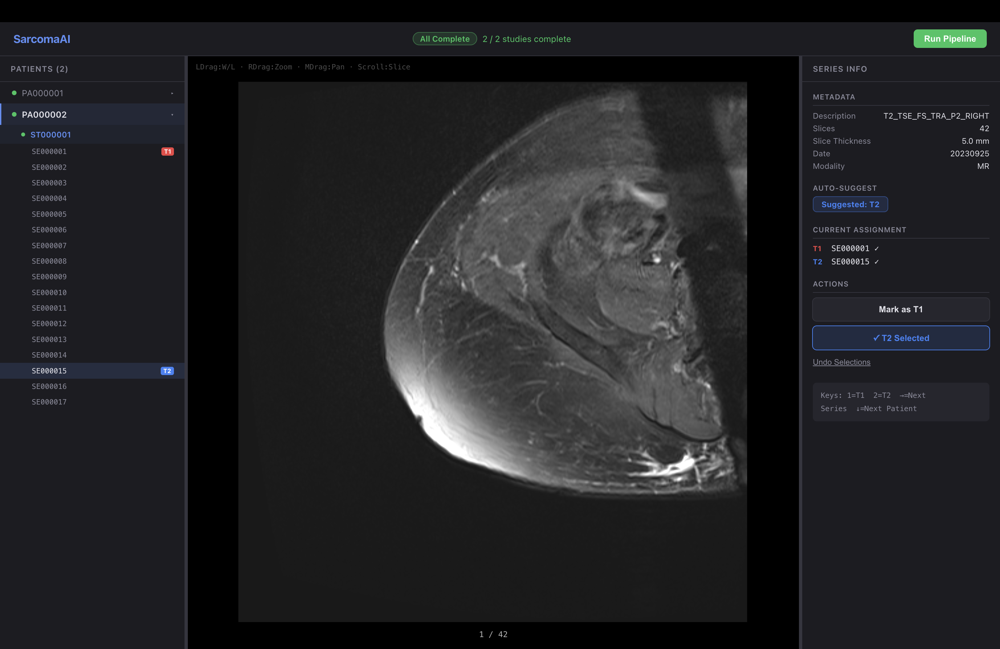
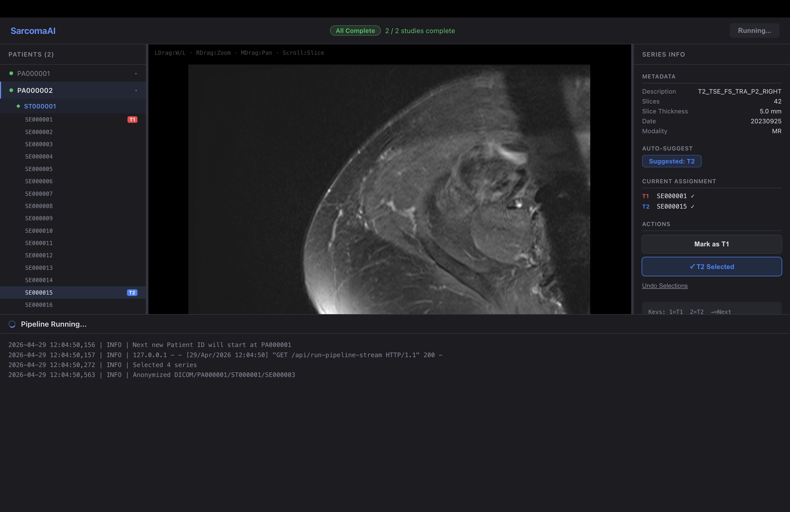

# SarcomaAI GUI

**A clinical desktop application for DICOM ingestion, MRI series review, and preprocessing — purpose-built to onboard cancer centers into a federated AI pipeline for soft tissue sarcoma prognosis.**

[](https://www.python.org/)
[](https://flask.palletsprojects.com/)
[](https://reactjs.org/)
[]()
[](https://doi.org/10.1038/s41698-024-00695-7)

> Built as the clinical data pipeline layer for the SarcomaAI project — a multimodal neural network (C-Index 0.769 overall survival, 0.699 distant metastasis) published in *NPJ Precision Oncology* (2024) by Bozzo et al., MSKCC & McGill University. [Read the paper →](https://doi.org/10.1038/s41698-024-00695-7)

---

## Why this app exists

Participating institutions in a federated learning study face a hard operational problem: their radiologists work in PACS systems, their data is stored as raw DICOM, and their IT departments cannot expose hospital systems to external pipelines. The SarcomaAI GUI solves this by running entirely **locally on the institution's own machine** — it ingests DICOM exports from the hospital, guides a radiologist through T1/T2 series selection on a proper MRI viewer, anonymizes all patient data, runs the preprocessing pipeline, and produces clean NIfTI files ready for federated model training. No data ever leaves the institution.

The app is distributed as a double-clickable `.dmg` (macOS) or `.exe` (Windows) — no Python, no terminal, no dependencies for the end user.

---

## Workflow

### Step 1 — Workspace Setup



The first screen the clinician or research coordinator sees. They select their **institution** from a dropdown (pre-configured with all participating SarcomaAI centers) and point the app to a folder on their local machine. The app automatically creates a structured workspace:

```
sarcomaai_workspace/
├── NEW_DICOMS/    ← drop new patient DICOM exports here
├── processed/     ← anonymized NIfTI output (auto-managed)
└── sarcomaai.db   ← local state, history, and audit trail
```

**Design reasoning:** Clinicians work across sessions. The workspace persists state in a local SQLite database so that T1/T2 selections, processing history, and patient status survive app restarts. The institution code is locked once set — preventing accidental re-labeling of data mid-study, which would corrupt the federated dataset.

---

### Step 2 — DICOM Import



The radiologist or coordinator points the app to their source DICOM folder — typically a manual export from the hospital PACS system. A native **OS folder picker dialog** opens (Finder on macOS, File Explorer on Windows), eliminating the need to type paths.

The import is **idempotent**: only patient folders not already in the workspace inbox are copied. Existing patients are automatically skipped with a log entry. This allows incremental onboarding — a center can import 10 patients today and 5 more next month without duplicating work.

**Design reasoning:** Browsers cannot access native filesystem paths for security reasons — a standard drag-and-drop would be silently blocked. The folder picker is implemented server-side via `osascript` (macOS) / `tkinter` (Windows), so the path resolution happens in Python and is returned to the React frontend as a simple string. No browser security boundary is ever crossed.

---

### Step 3 — MRI Series Review & T1/T2 Selection



The core clinical screen. The left sidebar shows the full patient/study/series hierarchy from the DICOM inbox. Clicking a series renders the MRI slices in a full-resolution viewer with scroll support. The right panel shows:

- **Series metadata** — description, slice count, slice thickness, acquisition date, modality
- **Auto-suggest** — the app analyzes the series description string and automatically suggests whether the series is T1 or T2, reducing manual decision time
- **Current assignment** — shows which series is currently marked as T1 and T2 for this patient
- **Action buttons** — one-click T1/T2 assignment, with visual confirmation

The top bar tracks progress across all patients: **"2/2 studies complete"** turns green when every patient has both a T1 and T2 assigned, unlocking the Run Pipeline button.

**Design reasoning:** The SarcomaAI model requires specifically a **T1 post-contrast** and a **T2 fat-saturated** sequence for every patient. A typical DICOM export from a sarcoma patient contains 6–15 series (localizers, different contrast phases, different planes). Asking a non-radiologist to identify the correct two series by filename alone is error-prone. The viewer lets clinicians scroll through slices to visually confirm what they're selecting — the same workflow used in clinical PACS review, just stripped down to only what's needed.

---

### Step 4 — T1 & T2 Confirmed, Ready to Run



Once both T1 and T2 are assigned for all patients, the top bar shows **"All Complete"** and the **Run Pipeline** button activates. The right panel confirms both assignments are locked in before the pipeline starts, giving the user a final review checkpoint.

**Design reasoning:** Preventing pipeline runs with incomplete selections avoids silent failures downstream — the preprocessing pipeline would produce bad NIfTI files if given the wrong series, corrupting the training data for all federated institutions. The explicit confirmation gate was added based on the real clinical workflow where series selection is a deliberate, reviewable step.

---

### Step 5 — Pipeline Execution with Live Logs



The pipeline runs in the background and streams real-time log output directly into the viewer UI — no terminal window, no separate process. Each log line is timestamped and color-coded.

Under the hood, the pipeline runs three stages per patient series:

1. **DICOM anonymization** — all PHI/PII tags scrubbed from DICOM metadata (patient name, DOB, MRN, institution) per the project's anonymization field list
2. **N4 bias field correction** — corrects MRI intensity non-uniformity using SimpleITK's implementation, essential for cross-scanner consistency in federated training
3. **Z-score normalization + NIfTI conversion** — standardizes voxel intensity distributions and outputs a `128×128×128` NIfTI volume compatible with the model's image subnetwork

**Design reasoning:** Log streaming is implemented using **Server-Sent Events (SSE)** from Flask to the React frontend via a persistent HTTP connection. The pipeline thread puts log records into a Python `queue.Queue` via a custom `logging.Handler` attached directly to each pipeline module's logger — bypassing Flask's root logger which would otherwise filter INFO-level messages in a bundled app. This architecture lets the UI stay responsive while a multi-hour pipeline runs in the background, which is critical for clinicians who need to continue working in the app.

---

## Architecture

```
┌─────────────────────────────────────────────────────────────┐
│                    SarcomaAI Desktop App                    │
│  (PyInstaller bundle — no external dependencies for user)   │
│                                                             │
│  ┌──────────────┐   HTTP/SSE    ┌─────────────────────────┐ │
│  │  React 18    │ ◄───────────► │  Flask 3.1 backend      │ │
│  │  Frontend    │               │                         │ │
│  │              │               │  /api/setup             │ │
│  │  • DICOM     │               │  /api/pick-folder       │ │
│  │    viewer    │               │  /api/import-stream     │ │
│  │  • Patient   │               │  /api/patients          │ │
│  │    sidebar   │               │  /api/series            │ │
│  │  • Live logs │               │  /api/slice             │ │
│  │  • T1/T2     │               │  /api/save-selection    │ │
│  │    selector  │               │  /api/run-pipeline-     │ │
│  └──────────────┘               │       stream (SSE)      │ │
│                                 └──────────┬──────────────┘ │
│                                            │                │
│                                 ┌──────────▼──────────────┐ │
│                                 │  python_pipeline/        │ │
│                                 │  • dicom_anonymize.py   │ │
│                                 │  • imaging_normalize.py │ │
│                                 │  • series_select.py     │ │
│                                 │  • pipeline_new.py      │ │
│                                 └──────────┬──────────────┘ │
│                                            │                │
│                                 ┌──────────▼──────────────┐ │
│                                 │  sarcomaai.db (SQLite)   │ │
│                                 │  selections, history,    │ │
│                                 │  audit trail             │ │
│                                 └─────────────────────────┘ │
└─────────────────────────────────────────────────────────────┘
         │
         ▼
  processed/  →  anonymized NIfTI files
                 ready for NVFlare federated training
```

---

## Tech Stack

| Component | Technology |
|---|---|
| Frontend | React 18, custom CSS, Server-Sent Events |
| Backend | Python 3.12, Flask 3.1, SQLite |
| DICOM | pydicom 3.0 |
| MRI preprocessing | SimpleITK (N4 bias correction), pyCERR, scipy, nibabel, scikit-image |
| Desktop packaging | PyInstaller 6 — macOS `.app` + `.dmg` via `create-dmg`, Windows `.exe` |
| OS folder picker | `osascript` (macOS), `tkinter` (Windows) |
| Real-time logging | Python `logging`, `queue.Queue`, Flask SSE |

---

## Building from Source

**Prerequisites:** Python 3.12, Node.js 18+, `create-dmg` (macOS only)

```bash
# 1. Set up the Python environment
python3.12 -m venv dist_venv
dist_venv/bin/pip install flask flask-cors pydicom matplotlib SimpleITK \
  scipy h5py pandas nibabel scikit-learn scikit-image PyWavelets \
  shapelysmooth itk pyinstaller \
  git+https://github.com/google-deepmind/surface-distance.git \
  git+https://github.com/cerr/pyCERR@d70e1d84be44693e9eafc6d6e8316b703a24ca6d

# 2. Build (macOS)
./build_app.sh
# Output: dist/SarcomaAI.app  +  dist/SarcomaAI.dmg
```

---

## Project Context

This GUI is the data ingestion layer for the **SarcomaAI federated learning initiative** — a multi-institution collaboration between McGill University Health Centre (MUHC) and Memorial Sloan Kettering Cancer Center (MSKCC) to build the first end-to-end multimodal AI model for soft tissue sarcoma prognosis. The underlying model is published:

> Bozzo et al. *"A multimodal neural network with gradient blending improves predictions of survival and metastasis in sarcoma."* NPJ Precision Oncology, 2024. [https://doi.org/10.1038/s41698-024-00695-7](https://doi.org/10.1038/s41698-024-00695-7)

**Built by Justin Kashi** — McGill University (MSc Biomedical Engineering), as part of the SarcomaAI team.
